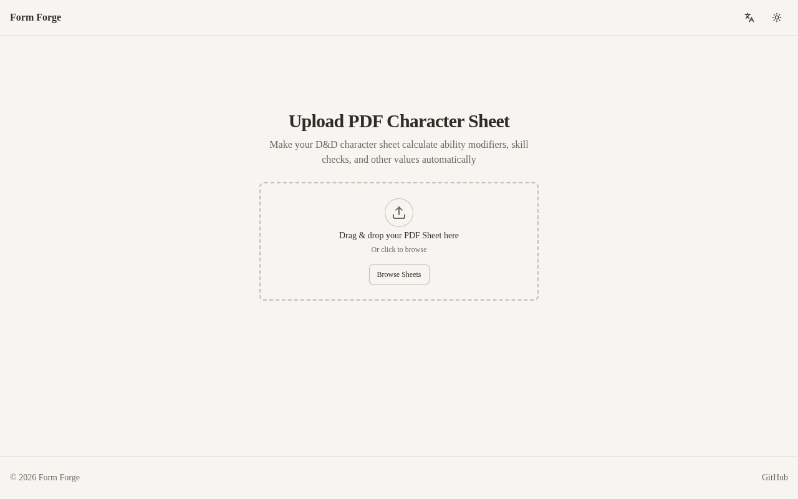
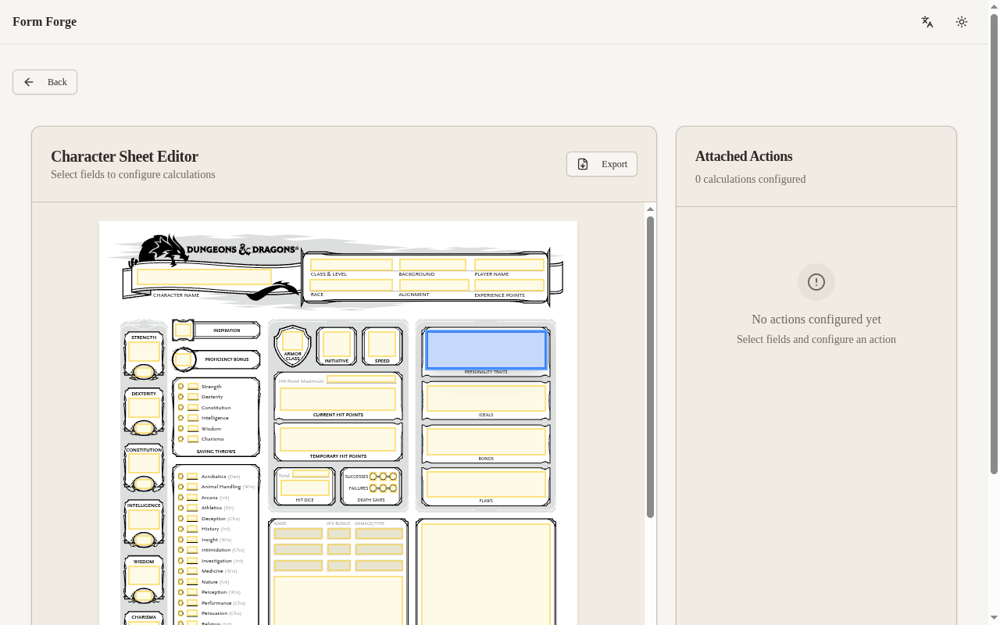
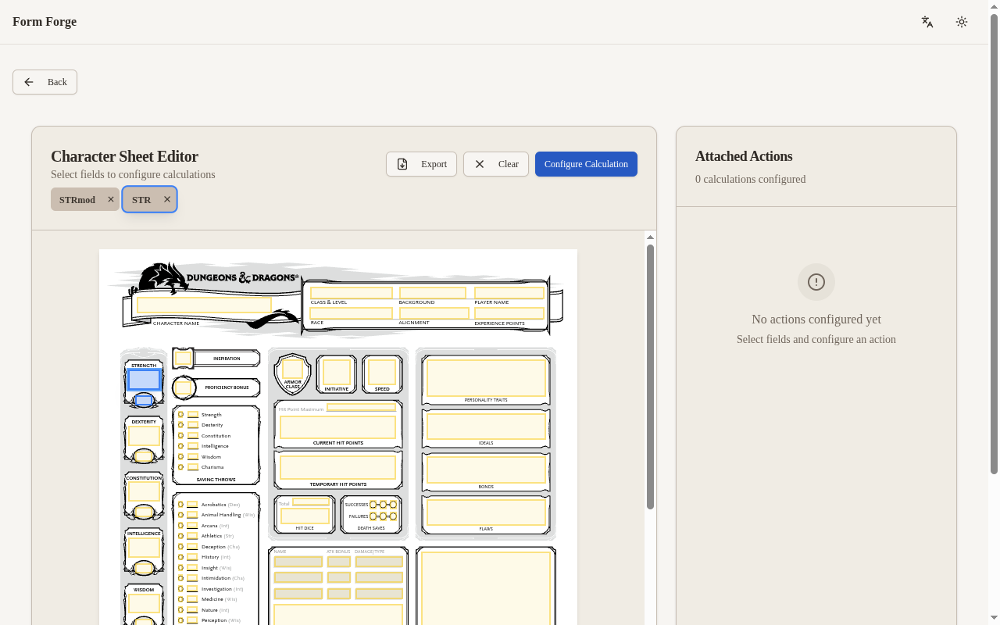
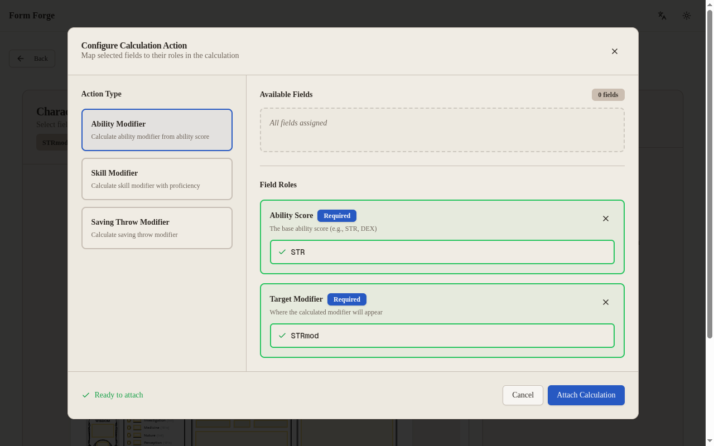
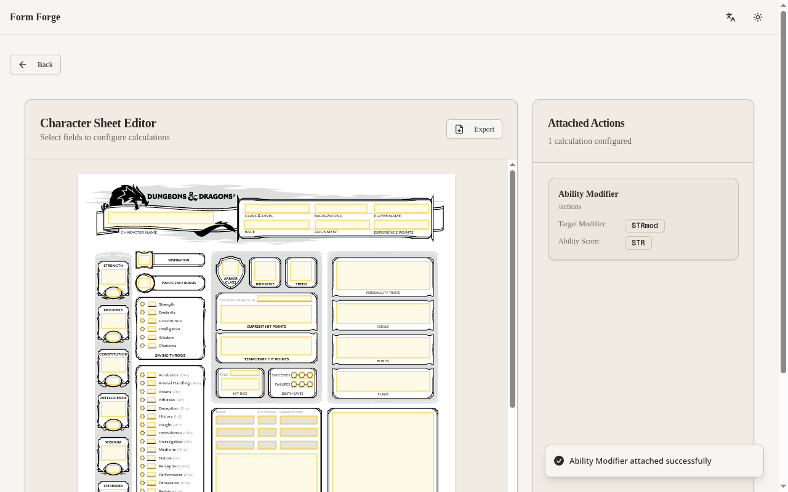

# Using Form Forge

A D&D character sheet is full of numbers that depend on other numbers. Your
Strength modifier comes from your Strength score. Your saving throws and skill
checks build on those modifiers and your proficiency bonus. Normally you work
all of that out by hand and redo it every time something changes.

Form Forge sets up those sums once and bakes them into your PDF. After that,
you type in a value like your Strength score and the sheet fills in the
results for you. No math, no scripting.

<video autoplay loop muted playsinline controls width="100%">
  <source src="../assets/usage/usage-flow.webm" type="video/webm">
</video>

## What "calculation" means here

A calculation is a rule that fills in one box from other boxes. For example:
your Strength modifier is always your Strength score minus 10, divided by two,
rounded down. You set that rule up once, and from then on the modifier appears
on its own whenever you enter a Strength score. You do this for each value you
want the sheet to work out: ability modifiers, saving throws, skill checks,
and so on.

Throughout this guide, a "field" is one of the boxes on the sheet you can
click into and type.

## Before you start

You need a fillable PDF character sheet: the kind where you can click into the
boxes and type. A scan or photo of a printed sheet won't work, because it has
no real boxes for Form Forge to attach calculations to. The official D&D
fillable character sheets work well.

## 1. Upload your character sheet

Open Form Forge and you land on the upload screen, headed **Upload PDF
Character Sheet**. Click **Browse Sheets** and pick your fillable PDF from the
file picker. Form Forge reads the sheet and takes you to the viewer.

## 2. Pick the fields for a calculation

The viewer shows your sheet with a button on every box it found. Click the
boxes that belong to one calculation. To set up a Strength modifier, click
your Strength score box (`STR`) and the box where the modifier should appear
(`STRmod`). The boxes you pick stay highlighted, so you can check them before
moving on.

## 3. Set up the calculation

With your boxes picked, click **Configure Calculation** and choose **Ability
Modifier**. Form Forge asks which box plays which part. An Ability Modifier
needs the box that holds the **Ability Score** and the box that shows the
**Target Modifier**. Pick one of your selected boxes for each part from the
dropdowns, then click **Attach Calculation**. The calculation shows up in the
list on the side.

## 4. Download your sheet

Click **Export**. Form Forge hands back your character sheet with the
calculation built in.

!!! tip "Open it in the right reader"
    Open the exported PDF in a reader that runs form calculations, such as
    Adobe Acrobat Reader. Type a Strength score and watch the modifier fill
    itself in. Some phone and in-browser previewers skip these calculations,
    so if the numbers don't update, try Acrobat Reader.

## Add more calculations

Saving throws and skill checks work the same way, with a few more parts to
fill in. See [Saving throws & skill checks](calculations.md) for those, and
the [calculation reference](../reference/index.md) for every type and the
fields it needs.
